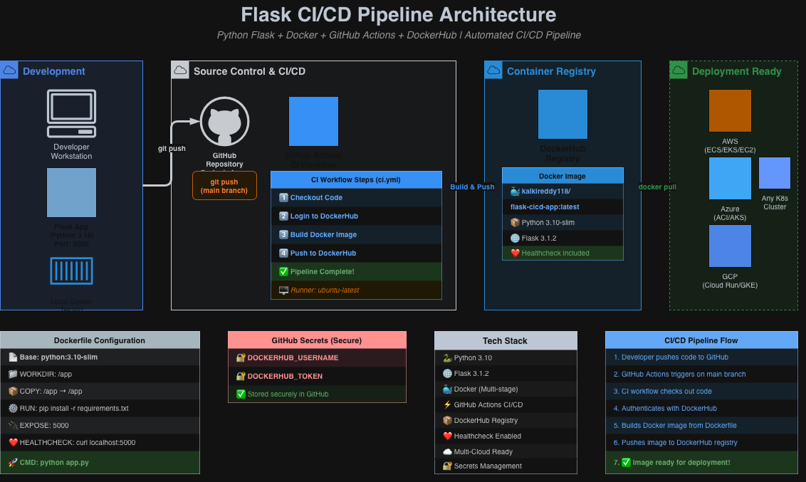

---

A lightweight Flask application demonstrating CI/CD automation using GitHub Actions and Docker.

---

## 🏗️ Architecture Overview



### Components

| Component | Technology | Purpose |
|-----------|-----------|---------|
| **Source Control** | GitHub | Version control & code repository |
| **CI/CD Pipeline** | GitHub Actions | Automated testing & build |
| **Testing** | Python unittest | Unit test validation |
| **Containerization** | Docker | Package application for deployment |
| **Application** | Flask | Python web framework |
| **Deployment Target** | AWS (optional) | Deploy Docker image to cloud |

---

## 📌 Project Overview

This project demonstrates:

- How to build a lightweight Flask application  
- How to containerize it using Docker  
- How to automate testing and builds using GitHub Actions  
- How CI/CD pipelines work in real-world DevOps workflows  

---

## 🚀 Features

- Simple Flask web application
- Dockerized for portability
- Automated CI pipeline using GitHub Actions
- Unit tests included
- Ready for deployment to AWS, Azure, or GCP
- Clean and minimal codebase for demonstration

---

## 🧱 Tech Stack

- Python 3
- Flask 3.1.2
- Docker

---

## 🛠️ Getting Started

### Prerequisites
- Python 3.9+
- Docker (for containerization)

---

### 1. Run Locally (without Docker)

```bash
# Clone the repo
git clone git@github.com:Kalkireddy/flask-cicd-app.git
cd flask-cicd-app/app

# Create and activate a virtual environment
python3 -m venv venv
source venv/bin/activate

# Install dependencies
pip install -r requirements.txt

# Run the app
python app.py
```

---

### 2. Run with Docker

Build the image:
```bash
docker build -t flask-app .
```

Run the container:
```bash
docker run -p 5000:5000 flask-app
```

App will be available at: http://localhost:5000

---

### 3. Repo Structure

```
flask-cicd-app/
├── app.py
├── Dockerfile
├── requirements.txt
├── tests/
│   └── test_app.py
├── .github/
│   └── workflows/
│       └── ci.yml
└── README.md
```

---

## 🏗️ CI/CD Pipeline Overview

Developer Push → GitHub Actions → Install Dependencies → Run Tests → Build Docker Image → (Optional) Deploy

The pipeline includes:
- Python setup
- Dependency installation
- Unit test execution
- Docker build validation

---

## 🧭 Roadmap Connection

This project is part of my DevOps learning and portfolio roadmap:

- Start with a simple Flask app
- Add CI/CD automation using GitHub Actions
- Containerize the app using Docker
- Deploy to cloud infrastructure (AWS)
- Manage infrastructure using Terraform

Together with my Terraform AWS repo, this demonstrates end-to-end DevOps capability.

---

## 🔐 Security Best Practices

- No secrets stored in code
- GitHub Actions uses secure runners
- Dockerfile follows minimal base image approach
- Dependencies pinned in requirements.txt

---

## 🔮 Future Enhancements

- Add CD pipeline to deploy Docker image to AWS ECS/ECR
- Add Terraform module to provision ECS infrastructure
- Add CloudWatch logging and monitoring
- Add automated Docker image scanning
- Add staging and production environments

---

## � Learning Resources

- [GitHub Actions Documentation](https://docs.github.com/en/actions)
- [Docker Official Documentation](https://docs.docker.com/)
- [Flask Documentation](https://flask.palletsprojects.com/)
- [Python CI/CD Best Practices](https://docs.python-guide.org/dev/ci-cd/)
- [DevOps Best Practices](https://aws.amazon.com/devops/what-is-devops/)

---

## 📝 License

This project is licensed under the **MIT License** — see [LICENSE](LICENSE) file for complete details.

**License Summary:**
- ✅ **Free to use, modify, and distribute**
- ✅ **Commercial use allowed**
- ✅ Attribution appreciated but not required
- ✅ Use as reference or fork for your own projects

---

## 👨‍💼 About the Author

**Shiv — Cloud & DevOps Architect**

**Expertise & Focus Areas:**
- ☸️ Kubernetes Expert (EKS, multi-cluster deployments, Helm)
- 🚀 Infrastructure as Code specialist (Terraform, CloudFormation)
- 🏗️ AWS Cloud Architecture & Design
- 💰 Cost Optimization & Performance Tuning
- 💼 Available for Upwork, contract work, and consulting

**Currently Pursuing:**
- 🎯 AWS Certified Solutions Architect (Professional) — In preparation

**Specializations:**
- AWS Infrastructure (EC2, VPC, ALB, ASG, RDS, S3, IAM)
- Kubernetes & Containerization (Docker, Helm, GitOps, HPA)
- Infrastructure as Code (Terraform, modular design)
- CI/CD Pipelines (GitHub Actions, Jenkins, automated deployments)
- Cost Optimization, performance tuning, and security hardening

**Open Source Contributions:**
- Maintain public DevOps portfolios & reusable templates
- MIT Licensed infrastructure & CI/CD projects
- Available for technical mentoring and consulting

---

## 🌐 My DevOps Portfolio

Explore more projects showcasing DevOps expertise:

**→ [shivdevops.cloud](https://shivdevops.cloud)**

**Other Projects:**
- [Kubernetes EKS Portfolio](https://github.com/Kalkireddy/kubernetes-eks-portfolio) — Production Kubernetes on AWS
- [Terraform AWS Infrastructure](https://github.com/Kalkireddy/terraform-aws-portfolio-infrastructure) — Modular AWS IaC
- [Portfolio Website](https://shivdevops.cloud) — Live professional portfolio

---

## 📬 Let's Connect

Looking to build scalable CI/CD pipelines or cloud infrastructure? Let's talk.

- 💼 **Upwork:** Available for consulting & contract work
- 📧 **Portfolio:** [shivdevops.cloud](https://shivdevops.cloud)
- 🐙 **GitHub:** [Kalkireddy](https://github.com/Kalkireddy)